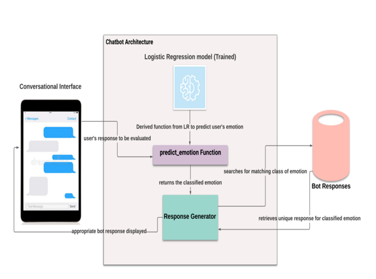

# Mental Health Assist and Diagnosis Conversational Interface

The research goal:

- Provide an effective way to communicate with a user and offer helpful emotional support.

- Save the user from making regular psychiatric visits that require a fixed duration.

- The chatbot offers a self-healing kit suggesting various exercises, both mental and physical that the user may implement in his day-to-day life.

## Applied methods

- Sentiment Analysis was performed to categorize the emotions as per the sentiment which will later be used to predict emotion in a more accurate way.
It was performed on each of the 8 emotions to further categorize them into “Positive”, “Negative” and “Neutral”.

- An ML model, specifically the Logistic Regression Model was trained on a dataset of emotions/text. 
Logistic Regression (LR) model was chosen as it was best at making predictions based on categories/groups of data.

- the user's input was passed into the “predict_emotion” function designed to identify the most probable emotion out of the eight.
The function value that is returned from this was made use of to pick out appropriate responses with therapist replies.

- python libraries used: 

    - pandas (for reading and updating the dataset)

    - numpy (for basic array creation and use)

    - neattext (for text cleaning),

    - seaborn (to visualize data and plot graphs)

    - textblob (for performing sentiment analysis on the dataset).

And this is our Architecture View :

   

# Result

- The accuracy of LR model was 0.62

- The accuracy of Naive-Bayes model was 0.56

LR model was found to be better than Naïve-Bayes

